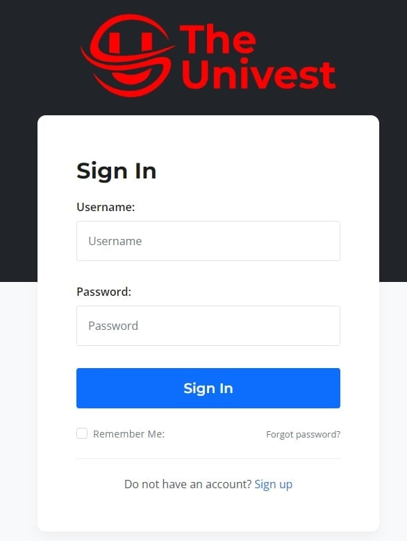
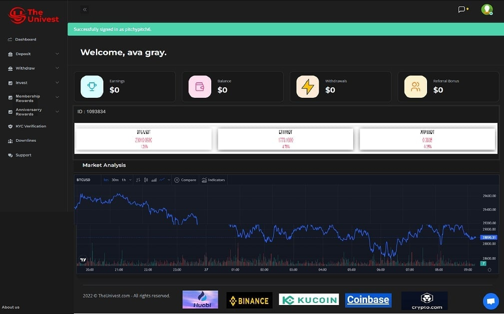
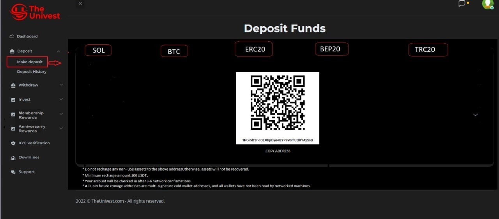
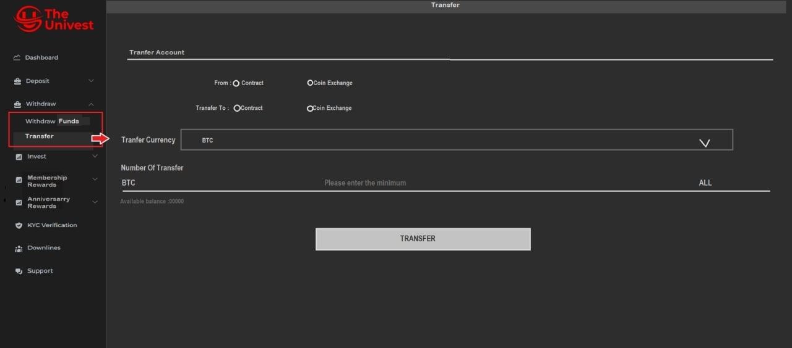
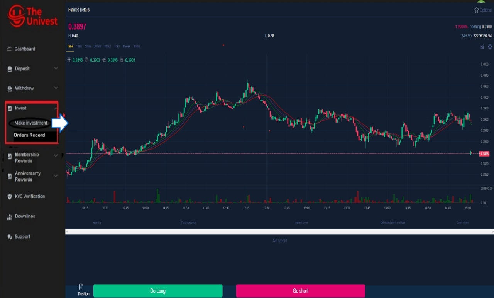
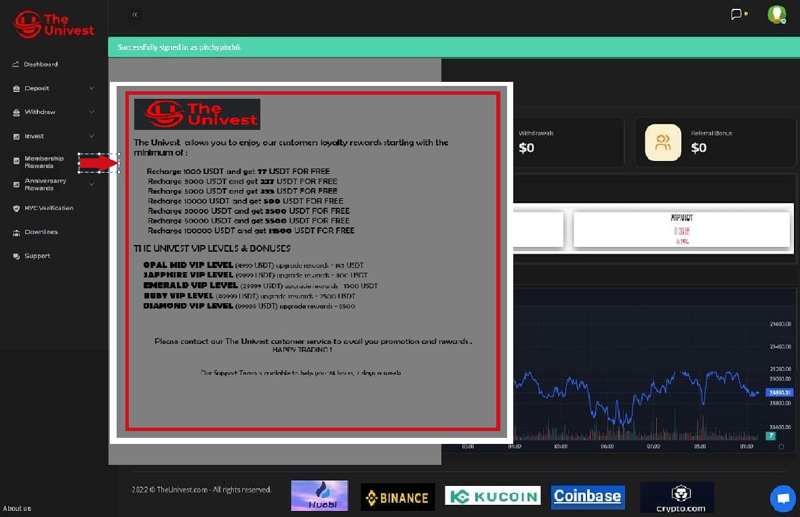
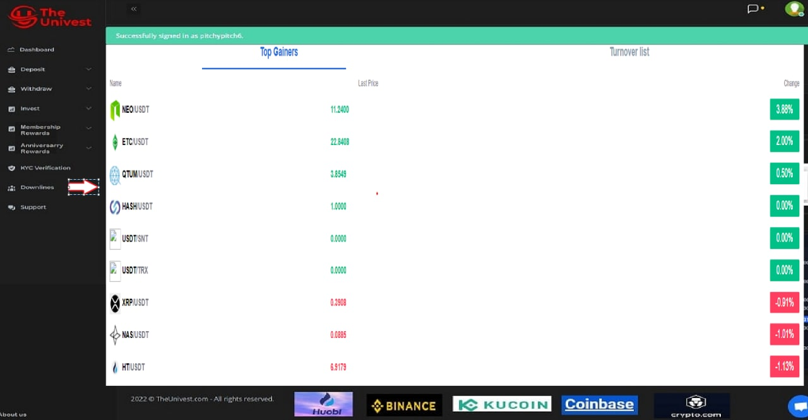

* Requirments
1. domain: un1vest.com;

2. Based on the 2nd platform,  example site: https://theunivest.com;

3. Only for English users, should no Chinese characters appear;

4. Main theme color: black and red;

5. All platform font family is "Verdana, Arial, Helvetica, sans-serif";

6. The homepage should same as the example site;

7. The Login and register should same as the example site, **the registeration code should have 120 seconds to enter it**;
   
   

8. The dashboard of User Center(UC) should be like this;
   

9. The Deposit in the UC center should be like this;
   

10. The Withdraw in UC should be like this;
    

11. The Invest in UC should be like this(should embed the origin platform's second future);
    

12. The mining in UC should change its title to Membership reward, and should like this, **font should same as the platform**;

13. The Downline in UC should be like this *should match the platform theme, background shoudl black*;
    

14. The KYC in UC should embed in like before;
15. The footer of UC should contain many famous platforms and auto-scroll going to the left(just like 13's footer);
* Suggestion
* Schedule
